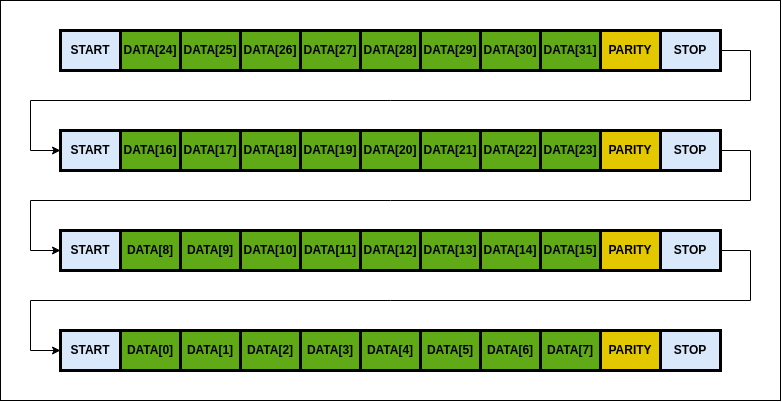
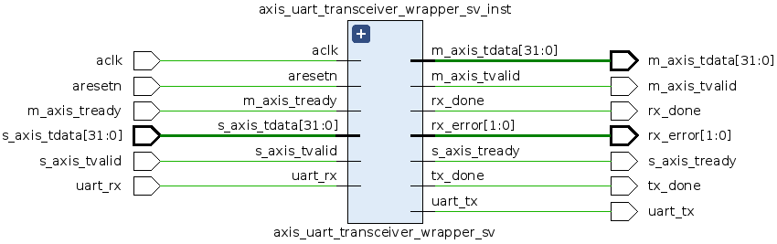

# Module: axis_uart_transceiver

## Description
### This module combines UART transmitter and receiver functionalities for AXI Stream data. It is designed to interface with AXI Stream protocols and provide UART communication.

### Important: This is a fully parameterizable module:
- `Supports all baud rates`.
- `Supports ODD and EVEN PARITY modes`.
- `Supports changing the number of data bits`.
- `Supports changing the number of stop bits`.
- `Supports transmitting a large number of bytes in a single AXI transaction`.
- `Supports changing the module clock frequency`.

### Note: Also included is a script for testing UART functionality in Python.

## Simulation
To simulate the project using `QuestaSim`, you can use `make` commands. The simulation environment is set up to compile, elaborate, and run the testbench. To clean up the files generated during the simulation, you can use `make clean`.

### Commands:
- `make`: Compile, elaborate, and run the simulation.
- `make clean`: Remove all files generated during the simulation.

### Note: Ensure that the path to QuestaSim (`vsim`) executable is added to your `bashrc` file.

## UART Frame
The UART protocol transmits data in frames. Each frame consists of a start bit, data bits, optional parity bit, and stop bits. An example frame is shown in the figure below.

## Wrappers
Wrapper modules are available in `Verilog` and `SystemVerilog`. The wrapper is illustrated in the figure below:

## Features
- UART transmission and reception
- Designed for high-speed data transfer in AXI Stream applications

## Parameters
- `AXI_DATA_WIDTH` : Width of the input data bus (default: 32 bits)
- `CLOCK`          : System clock frequency (default: 100 MHz)
- `BAUD_RATE`      : Baud rate for UART communication (default: 115200)
- `DATA_BITS`      : Number of data bits in UART frame (default: 8)
- `STOP_BITS`      : Number of stop bits in UART frame (default: 1)
- `PARITY_BITS`    : Parity configuration for UART frame (default: 0, 1 means even parity, 0 means odd parity)

## Ports
- `aclk`      : Input     : Clock signal
- `aresetn`   : Input     : Synchronous active-low reset
- `uart_rx`   : Input     : UART receive signal
- `uart_tx`   : Output    : UART transmit signal
- `tx_done`   : Output    : Flag indicating the completion of UART transmission
- `rx_done`   : Output    : Flag indicating the completion of UART reception
- `rx_error`  : Output    : Error flag for UART reception
- `m_axis`    : Interface : Master AXI Stream interface
- `s_axis`    : Interface : Slave AXI Stream interface

## Notes
- The `tx_done` and `rx_done` signals indicate the completion of transmission and reception respectively.
- The `rx_error` signal encodes different error states:
  - `00`: No error
  - `01`: Start bit error
  - `10`: Stop bit error
  - `11`: Parity bit error

## License
This is open-source code. The author makes no warranties, expressed or implied, and assumes no responsibility for any damage or loss resulting from the use of this code. Use it at your own risk.

## Standard
SystemVerilog IEEE 1800-2012

## Author
- **Name**: Semenov Maxim
- **Email**: makcsem64@gmail.com
- **Date**: 04.06.2024

## Important
Please make sure that `AXI_DATA_WIDTH` and `DATA_BITS` are divisible without remainder for proper device operation. `AXI_DATA_WIDTH` should be divisible by `DATA_BITS`. For example, if `AXI_DATA_WIDTH` = 64 and `DATA_BITS` = 8, it is valid. However, if `AXI_DATA_WIDTH` = 64 and `DATA_BITS` = 7, it is not valid and may cause unexpected behavior.
